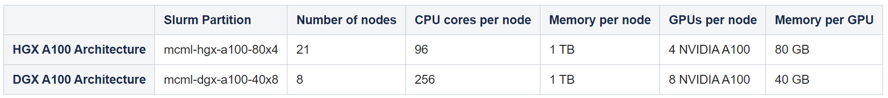
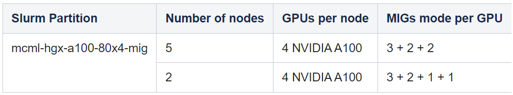
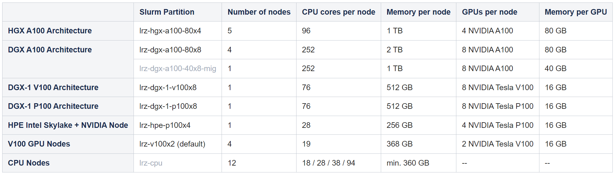
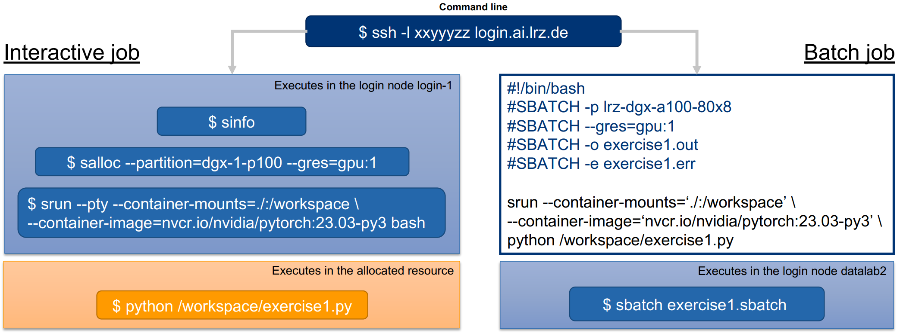
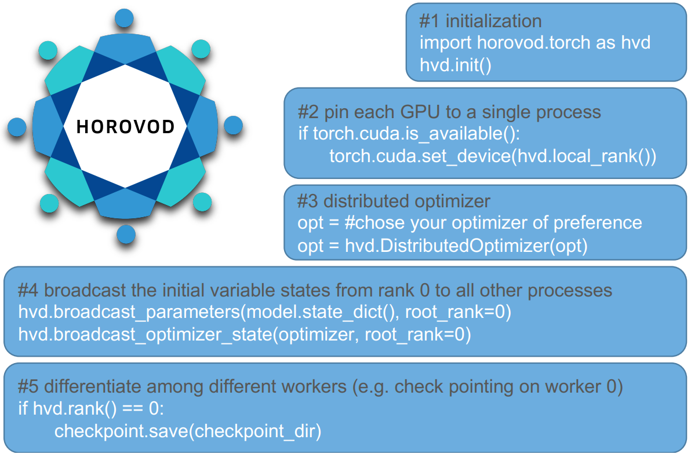

# How to use MCML AI System
The following provides MCML affliates with a documentation about how to use the MCML AI System for our deep learning training purposes. Please find the detailed documentation in the MCML wiki [here](https://doku.lrz.de/lrz-ai-systems-11484278.html).

# (0) Getting Started

(1) Get in contact with one of the master users (Stefan Fischer, Johannes Kiechle) \
(2) Ask them to create a personal LRZ ID, which will be the login ID for the MCML AI cluster (similar to TUM ID, usually with a number as extension: ge37bud --> ge37bud2) \
(3) Once you know your **personal LRZ ID** and the **email address** which is linked to the LRZ ID, please reset your passwort and create a personal one [here](https://idmportal.lrz.de/pwreset). Select: **I know an e-mail address associated with my LRZ account** and follow the instructions. \
(4) After setting your personal passwort please login into the [LRZ IDM Portal](https://idmportal2.lrz.de/jidmp/) and accept the export control statement which you can find on the drop down list on the left-hand side under **Policies** (otherwise you'll be not able to login into the LRZ AI Login Node from where you can start allocating GPU ressources). \
(5) Try to login into the LRZ AI Login Node using the command below.


In order to access the LRZ AI System please SSH into the login node using

```cmd
$ ssh login.ai.lrz.de -l your_user_ID
```
This login node is meant for preparing and submitting jobs to one or more of the available resources (see below), which are managed by the Slurm Workload Manager. \
Alternatively, if you favour "Klickibunti" you can login using a [web-based frontend](https://login.ai.lrz.de ).

# (1) Compute Hardware

### (1.1) Big Scale MCML Hardware (allocation time limit for individual jobs is 4 days)
Can only be used by MCML members. 


```cmd
Important: Users need to specify the "mcml" quality of service (QoS) for their job allocation

$ salloc --partition=mcml-hgx-a100-80x4 --qos=mcml --ntasks=4 --gres=gpu:4 
$ salloc --partition=mcml-dgx-a100-40x8 --qos=mcml --ntasks=8 --gres=gpu:8  
```

---

### (1.2) Small Scale MCML Hardware (allocation time limit for individual jobs is 4 days)
Can only be used by MCML members.


The first row indicates that there are five nodes whose GPUs are partitioned in three virtual GPU instances each: One with three slices out seven, and two with two slices each. The second row, indicates there are two nodes whose GPUs are partitioned in four virtual GPU instances each: one with three slices, one with two slices, and two with one slice. 

**Example:** If you want to allocate one instance with three slices (i.e., three seventh the capacity of a full A100) the following code block shows an example. 
```cmd
Important: Users need to specify the "mcml" quality of service (QoS) for their job allocation

$ salloc --partition=mcml-hgx-a100-80x48-mig --qos=mcml --gres=gpu:3g
```
The GPUs of the mcml-hgx-a100-80x4-mig partition can alternatively also be used in full by specifying the **--gres=gpu:[1-4]** option.

---

### (1.3) General Hardware (default time limit for individual jobs is one hour, maximum is 3 days)
Can also be used by non-MCML members.


```cmd
$ salloc --partition=lrz-dgx-a100-80x8 --ntasks=8 --gres=gpu:8 --time=3-00:00:00
```

# (2) Data Storage

Please use the following command to get an overview of all our accessible Data Storages

```console
$ dssusrinfo all
```

How to transfer data to the data science storage (DSS):

(1) Install [Globus Personal Connect](https://www.globus.org/globus-connect-personal) for your respective OS \
(2) Open Globus Personal Connect and login

# (3) Submitting a Job

Some useful slurm commands: 
```console
Show all available queues
$ sinfo 

Show reservation of queus (if there is any)
$ squeue

Create allocation of ressources
$ salloc 
Example:
$ salloc --partition=mcml-hgx-a100-80x4 --qos=mcml --ntasks=4 --gres=gpu:4 

Cancel allocation of ressources
$ scancel <JobID>

Run job
$ srun
Example:
$ srun --pty enroot start --mount ./data:/mnt/data ubuntu.sqush bash

Submit batch job into SLURM pipeline
$ sbatch
Example:
$ sbatch script.sbatch
```
--- 

# (4) Nvidia Container Repository

If you want to use enroot containers from the [nvidia container repository](https://catalog.ngc.nvidia.com/containers?filters=platform%7CPyTorch%7Cpltfm_pytorch&orderBy=weightPopularDESC&query=&page=&pageSize=), which is recommended, you first have to create an user account [here](https://ngc.nvidia.com/signin). Once you've done that, please create your personal API Key [here](https://ngc.nvidia.com/setup/api-key) **and do not forget to save it somewhere you'll find the key again**. Now follow the steps below:

```console
Login into LRZ AI Login Node
$ ssh login.ai.lrz.de -l your_user_ID

Create a folder called 'enroot' in your home directory (if it does not exist already)
$ mkdir enroot
$ cd enroot

Create a file called '.credentials' within the enroot directory
$ touch .credentials

Open the '.credentials' file with an editor
$ nano .credentials

Append the following line to the '.credentials' file and replace <API_KEY> with your personal API Key you created in the step expalined above: 

machine nvcr.io login $oauthtoken password <API_KEY>
```

# (5) Demo Application

```console
Login into LRZ AI Login Node
$ ssh login.ai.lrz.de -l your_user_ID

Allocate GPU
$ salloc --partition=mcml-dgx-a100-40x8 --qos=mcml --ntasks=1 --gres=gpu:1

Run interactive session within allocated ressource
$ srun --pty bash

Get CUDA+PyTorch container from nvidia container repository (only once!)
$ enroot import docker://nvcr.io/nvidia/pytorch:24.07-py3

Create container image from container file (every time you allocate a GPU!)
$ enroot create nvidia+pytorch+24.07-py3.sqsh

Run container as root
$ enroot start --root nvidia+pytorch+24.07-py3

How to reuse a container?
- Start container
- Install all necessary libraries using pip/conda
- Exit container

$ enroot export --output <new_container_name.sqsh> <current_container_name>
```
---

# (6) Interactive vs. Batch Jobs



---
# (7) Distributed Trainining - Multi-GPU

In order to use distributed training across several GPUs make sure you've installed **Horovod** in your enroot container. This can be done by invoking the following command:

```console
$ HOROVOD_GPU_OPERATIONS=NCCL HOROVOD_WITH_PYTORCH=1 pip install horovod[pytorch]
```



Please refer to the example [horovod script](./pytorch_imagenet_resnet50.py) to see the changes you have to apply in order to enable your training script for multi-GPU training.

```console
# Run training with 2 GPUs on a single machine
$ horovodrun -np 2 python pytorch_imagenet_resnet50.py
```

---
# (8) Tmux Basis

Here is a list of a few basic tmux commands:

- Ctrl+b " — split pane horizontally.
- Ctrl+b % — split pane vertically.
- Ctrl+b arrow key — switch pane.
- Hold Ctrl+b, don’t release it and hold one of the arrow keys — resize pane.
- Ctrl+b c — (c)reate a new window.
- Ctrl+b n — move to the (n)ext window.
- Ctrl+b p — move to the (p)revious window.